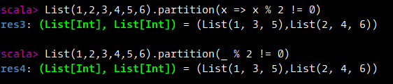

### Collections with Functions

#### Map

* Map takes a function and applies that function to every element in a collection
* Map can be applied to List, Set, Maps, Streams, Strings even Options

```scala
object MapFunction extends App {
    // List
    val a = List(1,2,3,4,5,6)
    val f = (x: Int) => x + 1

    println(a.map(f))
    println(a.map((x:Int) => x * 2))
    println(a.map(x => x * 2)) // Removing the type
    println(a.map(_ * 2))
    println(a.map(2 * _))

    import scala.language.postfixOps
    println(a.map(2 *))

    // Set
    val b = Set("Brown", "Red", "Blue", "Green", "Yellow", "Black")
    println(b.map(x => x.size))
    println(b.map(_.size))
    println(b.map(x => (x, x.size)))

    // Map
    val fifaTeam = Map('Germany -> 4, 'Brazil -> 5, 'Italy -> 3, 'Argentina -> 2)
    println(fifaTeam.map(t => (Symbol.apply("Team " + t._1.name), t._2)))

    // String
    println("Hello".map(c => c + 1))
    println("Hello".map(c => (c + 1).toChar))

    // Options
    println(Some(4).map(1+))
    // println(None.map(1+)) // error: ambiguous reference to overloaded definition // match expected type Nothing => ?

    println(None.asInstanceOf[Option[Int]].map(1+))
    val age:Option[Int] = None
    println(age.map(1+))
}
```


#### filter, filterNot, exists

* `filter` filters out elements that meet a predicate criteria
* `filterNot` filters out elements that do not meet the predicate criteria
* `exists` tests if something exists in a collection based on a function

```scala
object FilterFunction extends App {
    // Range
    val a = 1 to 10
    println(a.filter(x => x % 2 == 0)) // Filter even numbers
    println(a.filter(_ % 2 == 0)) // Filter even numbers
    println(a.filterNot(_ % 2 == 0)) // Filter odd numbers
    println(a.exists(_ % 2 == 0)) // Does it have even numbers

    // String
    def filterVowels(s:String) = s.toLowerCase.filter(c => Set('a','e','i','o','u').contains(c))
    println(filterVowels("Apple"))

    // Set
    val b = Set("Brown", "Red", "Blue", "Green", "Yellow", "Black")
    println(b.filter(s => filterVowels(s).size > 1))

    // Map
    val m = Map(1 -> "One", 2 -> "Two", 3 -> "Three", 4 -> "Four", 5 -> "Five")
    println(m.filterKeys(_ % 2 == 0))

    // Options
    println(Some(5).filter(_ % 2 == 0)) // None
    println(Some(6).filter(_ % 2 == 0))
}
```


#### foreach

* `foreach` is a method that takes a function which takes each element and returns `Unit`
* Its perfect to use when you want to take an element and perform a side-effect like printing on a screen
* `foreach` is available for lists, ranges, sets, maps, options etc.

```scala
object ForEachMethod extends App {
    val a = 1 to 10
    // a.foreach(x => println(x))
    // a.foreach(println(_))
    // a.foreach(println _)
    a foreach println
}
```


#### flatMap

* `flatMap` for collections is a combination of flatten and map

```scala
object FlatMap extends App {
    val a = List(1,2,3,4)
    println(a.map(x => List(-x, 0, x)))
    println(a.map(x => List(-x, 0, x)).flatten)
    println(a.flatMap(x => List(-x, 0, x)))

    val b = List(List(List(1,2,3), List(4,5,6)), List(List(7,8,9), List(10,11,12)))
    println(b.flatMap(c => c))
    println(b.flatMap(c => c).flatMap(c => c))

    println(Set(2,4,6,8,10).flatMap(x => Set(x, x * 5)))

    val m = Map(1 -> "One", 2 -> "Two", 3 -> "Three")
    println(m.flatMap(t => Map(t._1 -> t._2, (t._1 * 100) -> (t._2 + " Hundred"))))

    println(Some(5).map(x => Some(x + 10)))
    println(Some(5).flatMap(x => Some(x + 10)))

    // println(None.flatMap(x => Some(x + 10))) // Error
    println(None.asInstanceOf[Option[Int]].flatMap(x => Some(x + 10)))
    println(Some(10).flatMap(x => None))

    println(List(Some(1), Some(2), None, Some(3), None, Some(4)).flatMap(x => x))
}
```


#### For Comprehensions

* For comprehensions are just `map`, `flatMap`, `withFilter` and `foreach` behind the scenes
* They look like for loops but are not
* They return collections like Lists, Sets, Options etc.

```scala
object ForComprehensions extends App {
    for(i <- 1 to 5) {
        println(i)    
    }

    val result1 = for(i <- 1 to 5) yield (i + 1)
    println(result1)

    val result2 = (1 to 5).map(_ + 1)
    println(result2)

    val result3 = for (i <- Some(100)) yield (i + 10)
    println(result3)

    val result4 = Some(100).map(_ + 10)
    println(result4)

    val result5 = for(i <- List(1,2,3); j <- List(4,5,6)) yield(i,j)
    println(result5)

    val result6 = List(1,2,3).flatMap(i => List(4,5,6).map(j => (i,j)))
    println(result6)

    val result7 = for(i <- List(1,2,3,4) if (i % 2) == 0; j <- List(5,6)) yield (i,j)
    println(result7)

    val result8 = List(1,2,3,4).withFilter(_ % 2 == 0).flatMap(i => List(5,6).map(j => (i,j)))
    println(result8)
}
```


#### Fold and Reduce

* `foldLeft` and `foldRight` will perform a reduction operation with a seed value
* `reduceLeft` and `reduceRight` will perform a reduction operation without a seed value

```scala
object FoldAndReduce extends App {
    val foldLeftResult = (1 to 10).foldLeft(0){(total:Int, next:Int) => println(s"Total: $total, Next: $next"); total + next}
    println(foldLeftResult)
    println("-----------")

    val reduceLeftResult = (1 to 10).reduceLeft{(total:Int, next:Int) => println(s"Total: $total, Next: $next"); total + next}
    println(reduceLeftResult)
}
```


```scala
object FoldAndReduce extends App {
    val foldRightResult = (1 to 10).foldRight(0){(next:Int, total:Int) => println(s"Total: $total, Next: $next"); total + next}
    println(foldRightResult)
    println("-----------")

    val reduceRightResult = (1 to 10).reduceRight{(next:Int, total:Int) => println(s"Total: $total, Next: $next"); total + next}
    println(reduceRightResult)
    println("-----------")

    println((1 to 10).sum)
    println((1 to 10).product)
}
```


Let us refactor the above code

```scala
object FoldAndReduce extends App {
    println((1 to 10).foldLeft(0)(_ + _)) // foldLeft
    println((1 to 10).foldRight(0)(_ + _)) // foldRight
    println((1 to 10).reduceLeft(_ + _)) // reduceLeft
    println((1 to 10).reduceRight(_ + _)) // reduceRight
}
```


#### Zip

* Zip merges two Collections
* Zip result will be the size of the shorter collection

```scala
object Zip extends App {
    val a = List(1,2,3,4)
    val b = List(5,6,7,8)
    println(a zip b)
    println((1 to 5) zip (6 to 8))
    println((1 to 2) zip (6 to 9))
}
```


#### Other methods




